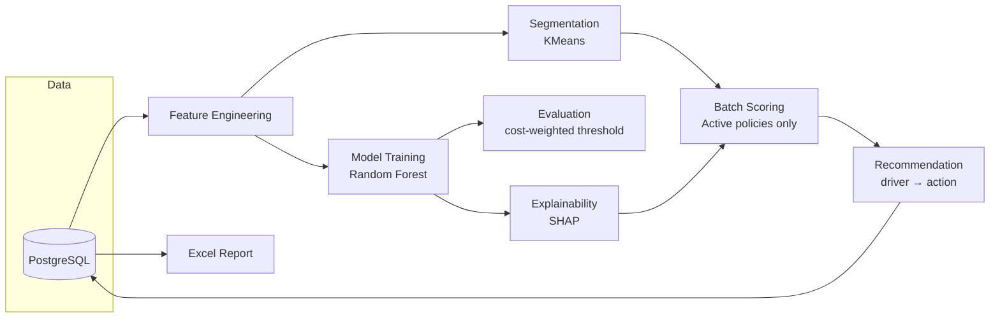
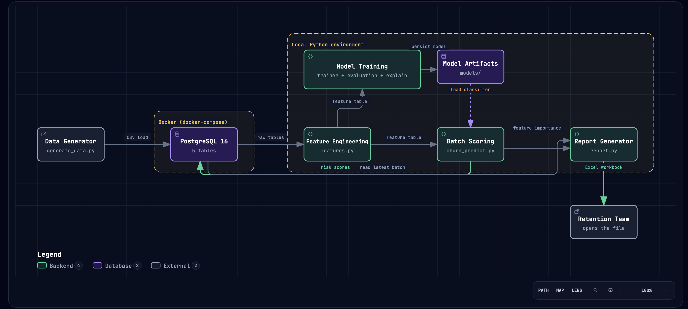

# Payment Churn Risk Prediction

Predict which insurance policies are at risk of cancellation from payment
behavior alone — then explain *why*, and tell someone what to do about it.

---

## Problem

Insurance policies rarely cancel without warning. Long before a customer
formally cancels, their payment behavior usually degrades first: a missed
invoice here, a failed card charge there, payments landing later each
cycle. That signal exists in the data most insurers already have — but it
typically isn't turned into anything actionable until the cancellation has
already happened.

A model that outputs a bare probability doesn't solve this. A retention
team can't act on "this policy has a 62% churn score" — they need to know
**who** is at risk, **why**, and **what to actually do** before that
customer leaves.

## Solution

An end-to-end pipeline that goes from raw payment history to a business
decision:

1. **Behavioral features** — missed/failed/late payment ratios, days-late
   trends, tenure — built from raw invoice and payment records.
2. **Segmentation** — unsupervised clustering surfaces natural risk
   tiers, validated against a held-out ground-truth label.
3. **A classifier** — trained to distinguish churned from retained
   policies, evaluated as a cost decision (a false alarm costs a wasted
   outreach; a miss costs a lost customer with no warning) rather than
   just accuracy.
4. **Explainability** — SHAP breaks every score down into the specific
   behaviors driving it, per policy and in aggregate.
5. **A recommendation layer** — maps each policy's top driver to a
   concrete suggested action.
6. **A report** — everything above, delivered as a single Excel file a
   retention or ops team can open directly. No server, no login, no app
   to learn.

## Architecture





Everything downstream of scoring reads from Postgres — the report never
recomputes a model or a SHAP value; it just formats what batch scoring
already persisted.

For an interactive, more detailed view — component boundaries, and a
data-flow diagram that makes the training-vs-scoring split explicit —
open the [architecture diagram](https://pacordev.github.io/insurance_payment_churn/diagrams/architecture.html)
and the [data-flow diagram](https://pacordev.github.io/insurance_payment_churn/diagrams/dataflow.html)
in your browser (pan/zoom, theme toggle, and guided views included).

## Screenshots

There's no hosted app to screenshot — the deliverable is a workbook you
open locally. Here's what it actually contains, straight from a real run
against the seeded dataset (282 active policies):

**Policy Detail sheet** (sorted by risk, color-coded by segment):

| Policy | Churn Risk | Segment | Product | Status | Suggested Action | Why Flagged |
|---|---|---|---|---|---|---|
| POL-63B2B68F | 23% | 🔴 High risk | Umbrella | Active | Prompt a payment-method update... | Repeated failed payment attempts |
| POL-1C1CDD7E | 21% | 🟡 Medium risk | Home | Active | Proactive outreach before the next invoice... | History of missed payments |
| POL-DA232D8E | 15% | 🟢 Low risk | Health | Active | Proactive outreach before the next invoice... | History of missed payments |

**Summary sheet** (with native Excel bar charts):

| Metric | Value |
|---|---|
| Policies scored | 282 |
| Flagged at risk | 105 (37%) |
| Low / Medium / High risk | 177 / 83 / 22 |

Want to see the real thing instead of a table? [`docs/risk_report_yyyymmdd.xlsx`](docs/risk_report_yyyymmdd.xlsx)
is an actual sample report generated by this pipeline — download it and
open it in Excel to see the full 282-row detail sheet, the color coding,
and the live bar charts firsthand.

## Features

- **Behavior-based feature engineering** from raw invoice/payment data —
  missed/failed/late ratios, days-late trend deltas, tenure
- **Unsupervised segmentation** that never sees the churn label, validated
  against a hidden ground-truth profile
- **Two models compared** — a logistic regression baseline and a random
  forest, chosen for both accuracy and explainability
- **Decision-focused evaluation** — precision/recall/ROC-AUC/PR-AUC,
  calibration, and a threshold picked by weighing false-positive vs.
  false-negative business cost, not a default 0.5
- **SHAP explainability**, per-policy and aggregate
- **Automatic recommendations** — each policy's top actionable driver maps
  to a plain-language suggested action
- **Active-only scoring** — only currently open policies get scored; a
  cancelled policy's "risk" already happened and isn't actionable
- **One Excel report per day** — colored, filterable, chart-backed, no
  server required

## Technology

| Layer | Choice |
|---|---|
| Database | PostgreSQL 16 (Docker) |
| Language | Python 3.14 |
| DB access | SQLAlchemy + psycopg |
| Data/features | pandas, numpy |
| Modeling | scikit-learn (LogisticRegression, RandomForestClassifier) |
| Explainability | SHAP |
| Model persistence | joblib |
| Reporting | openpyxl |
| Testing | pytest |

## Testing

60 tests, all pure-function tests against synthetic data — no live
database required to run the suite:

```bash
pytest
```

Every pipeline stage has its own test file (feature engineering,
segmentation, training, evaluation, explainability, recommendations,
batch scoring, reporting). Database-writing functions are exercised
manually against the live container rather than mocked, matching how the
project treats integration points.

## Deployment

This project runs locally today: PostgreSQL via `docker-compose.yml`,
everything else via a local virtual environment. There is no hosted
service — the report is a file you generate and hand off, not a
dashboard someone visits.

## Future improvements

- **On-demand serving** — a small FastAPI `/predict` endpoint for
  scoring a single policy on request (deferred until there's an actual
  need for it)
- **Real data** — this project runs on generated synthetic data; the
  pipeline is designed to plug into a real payment-history warehouse with
  the same shape
- **Scheduled reporting** — a cron/Airflow job running
  `churn_predict` → `report` on a schedule instead of by hand
- **Multi-batch trend view** — `tbl_policy_risk_score` already keeps a
  full history per policy; a trend chart per policy is the natural next
  step
- **Gradient boosting** — the model comparison stopped at random forest;
  XGBoost/LightGBM is a natural next candidate

---

For setup and usage instructions, the full technical reference — schema,
module-by-module breakdown, modeling methodology — and worked examples
showing exactly how a policy's raw payment history becomes a risk score,
see [`docs/Technical.md`](docs/Technical.md).
